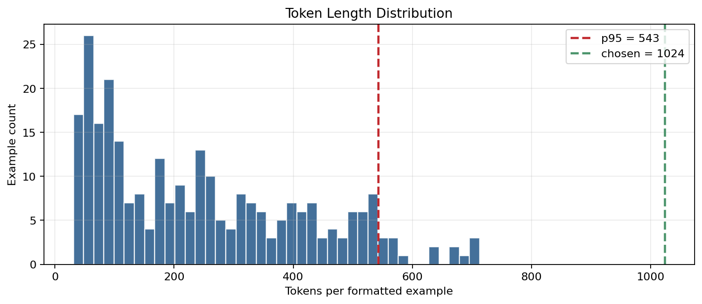
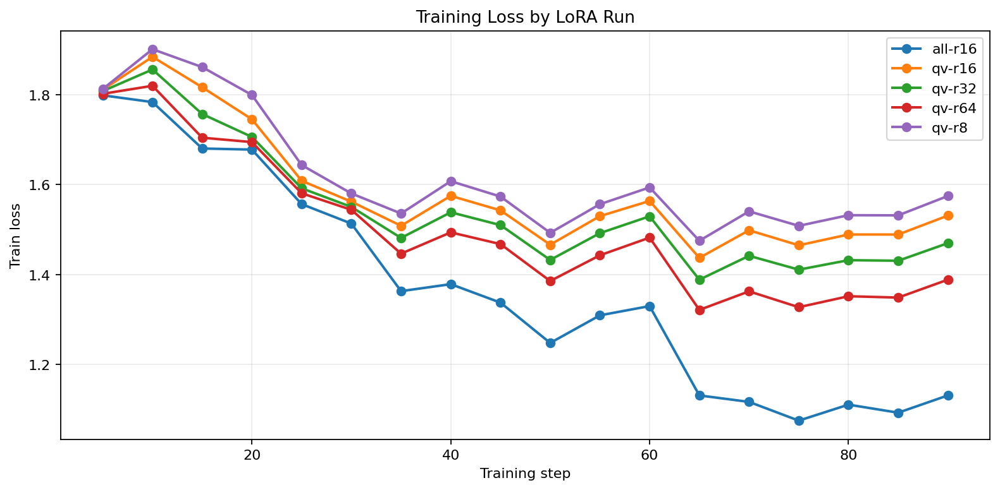

# Lab 21 - LoRA/QLoRA Rank Experiment

Submission for Day 21 fine-tuning lab.

Student: Đặng Văn Minh  
Student ID: 2A202600027  
Option: B - GitHub + HuggingFace Hub

## Quick Grading

- Main report: [REPORT.md](REPORT.md)
- All links: [LINKS.md](LINKS.md)
- Colab notebook: [Lab21_MaxScore_Llama32_LoRA_QLoRA_Colab.ipynb](Lab21_MaxScore_Llama32_LoRA_QLoRA_Colab.ipynb)
- Metrics CSV: [results/rank_experiment_summary.csv](results/rank_experiment_summary.csv)
- Qualitative CSV: [results/qualitative_comparison.csv](results/qualitative_comparison.csv)

## Experiment Summary

- Base model: `unsloth/Llama-3.2-3B-Instruct-bnb-4bit`
- Dataset: `5CD-AI/Vietnamese-alpaca-gpt4-gg-translated`
- Clean sample size: 273 examples
- Split: 245 train / 28 eval, seed `42`
- GPU: Tesla T4 16 GB on Google Colab
- Method: QLoRA 4-bit with Unsloth + TRL
- Required ranks trained: `qv-r8`, `qv-r16`, `qv-r64`
- Bonus runs: `qv-r32`, `all-r16`
- Tracking: W&B enabled
- Hub upload: best adapters uploaded to HuggingFace Hub

## Key Results

| Run | Target | Rank | Eval loss | Perplexity | Peak VRAM |
|---|---|---:|---:|---:|---:|
| base | none | - | 2.3200 | 10.1756 | - |
| qv-r8 | q/v | 8 | 1.7600 | 5.8125 | 7.00 GB |
| qv-r16 | q/v | 16 | 1.7490 | 5.7487 | 6.24 GB |
| qv-r32 | q/v | 32 | 1.7459 | 5.7311 | 7.86 GB |
| qv-r64 | q/v | 64 | 1.7523 | 5.7676 | 8.76 GB |
| all-r16 | all layers | 16 | 1.7116 | 5.5380 | 9.55 GB |

Best q/v-only rank by perplexity: `qv-r32`.  
Best overall adapter: `all-r16`.  
Recommended practical default on T4: `qv-r16`, because it is close to `qv-r32` in perplexity with fewer trainable parameters.

## Repository Structure

```text
.
├── REPORT.md
├── LINKS.md
├── Lab21_MaxScore_Llama32_LoRA_QLoRA_Colab.ipynb
├── results/
│   ├── rank_experiment_summary.csv
│   ├── qualitative_comparison.csv
│   ├── loss_history.csv
│   ├── loss_curve.png
│   ├── train_loss_wandb.png
│   └── token_length_distribution.png
├── docs/
│   └── lab21_execution_spec.md
└── notebooks/
    └── Lab21_LoRA_Finetuning_T4_template.ipynb
```

## Result Figures





## HuggingFace Adapters

- `qv-r16`: https://huggingface.co/DangMinh21/VinUni-lab21-Finetuning-w-LoRA-QLoRA-qv-r16
- best rank `qv-r32`: https://huggingface.co/DangMinh21/VinUni-lab21-Finetuning-w-LoRA-QLoRA-best-rank
- `all-r16`: https://huggingface.co/DangMinh21/VinUni-lab21-Finetuning-w-LoRA-QLoRA-all-r16

## Checklist

- [x] Dataset formatted in Alpaca style
- [x] Token p95 analysis completed
- [x] Base model perplexity evaluated
- [x] Required rank runs trained and evaluated: `r=8`, `r=16`, `r=64`
- [x] Bonus rank run trained: `r=32`
- [x] Bonus all-layers run trained: `all-r16`
- [x] W&B tracking links included
- [x] HuggingFace adapters uploaded
- [x] Report follows the 6 required sections
