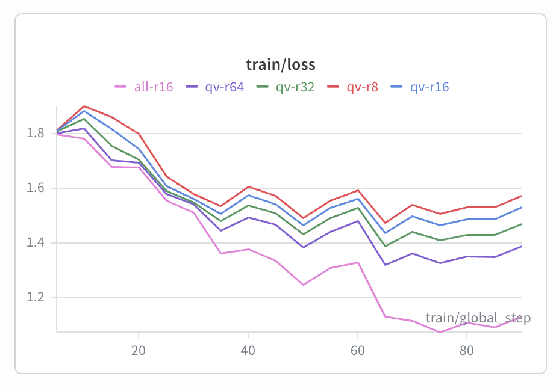

# Lab 21 Report - LoRA/QLoRA Rank Experiment

Student: Đặng Văn Minh  
Student ID: 2A202600027  
Submission option: Option B - GitHub + HuggingFace Hub

## 1. Setup

- Base model: `unsloth/Llama-3.2-3B-Instruct-bnb-4bit`
- Dataset: `5CD-AI/Vietnamese-alpaca-gpt4-gg-translated`
- Sample size sau khi clean: 273 examples
- Split: 245 train / 28 eval, seed `42`
- Token p95: 543 tokens
- `max_seq_length`: 1024
- GPU: Tesla T4, 15.64 GB VRAM
- Training config: 3 epochs, learning rate `2e-4`, cosine scheduler, warmup ratio `0.10`
- Batch config: train batch size `1`, gradient accumulation `8`, effective batch size `8`
- Optimizer: `adamw_8bit`
- Packing: `False`
- Tổng thời gian training adapter: 24.61 phút
- Estimated cost: khoảng `$0.14` nếu tính T4 ở `$0.35/hour`
- GitHub repository: https://github.com/DangMinh21/Day21-Track3-Finetuning-LLMs-LoRA-QLoRA
- Colab notebook: https://github.com/DangMinh21/Day21-Track3-Finetuning-LLMs-LoRA-QLoRA/blob/main/Lab21_Llama32_LoRA_QLoRA_Colab.ipynb
- HF Hub adapters:
  - `qv-r16`: https://huggingface.co/DangMinh21/VinUni-lab21-Finetuning-w-LoRA-QLoRA-qv-r16
  - best rank `qv-r32`: https://huggingface.co/DangMinh21/VinUni-lab21-Finetuning-w-LoRA-QLoRA-best-rank
  - `all-r16`: https://huggingface.co/DangMinh21/VinUni-lab21-Finetuning-w-LoRA-QLoRA-all-r16
- W&B run links: xem đầy đủ trong `LINKS.md`

## 2. Rank Experiment Results

Tất cả LoRA runs dùng cùng dataset, split, seed, learning rate, epochs, batch size, scheduler và optimizer. Các run q/v-only chỉ khác `rank` và `alpha`; run `all-r16` là bonus để so sánh target modules.

| Run | Target | Rank | Alpha | Trainable params | Trainable % | Time (min) | Peak VRAM (GB) | Eval loss | Perplexity | Final train loss |
|---|---:|---:|---:|---:|---:|---:|---:|---:|---:|---:|
| base | none | - | - | - | - | - | - | 2.3200 | 10.1756 | - |
| qv-r8 | q/v | 8 | 16 | 2,293,760 | 0.1270 | 4.82 | 7.00 | 1.7600 | 5.8125 | 1.5746 |
| qv-r16 | q/v | 16 | 32 | 4,587,520 | 0.2537 | 4.91 | 6.24 | 1.7490 | 5.7487 | 1.5310 |
| qv-r32 | q/v | 32 | 64 | 9,175,040 | 0.5062 | 4.83 | 7.86 | 1.7459 | 5.7311 | 1.4698 |
| qv-r64 | q/v | 64 | 128 | 18,350,080 | 1.0072 | 4.87 | 8.76 | 1.7523 | 5.7676 | 1.3886 |
| all-r16 | all | 16 | 32 | 24,313,856 | 1.3302 | 5.19 | 9.55 | 1.7116 | 5.5380 | 1.1313 |

Kết quả chính:

- Fine-tuning giúp giảm perplexity rõ rệt so với base: từ `10.18` xuống khoảng `5.54-5.81`.
- Trong nhóm q/v-only, `qv-r32` có perplexity tốt nhất (`5.7311`), nhưng chỉ nhỉnh hơn `qv-r16` rất nhẹ (`5.7487`).
- `qv-r64` dùng gấp đôi trainable params so với `qv-r32` nhưng perplexity lại kém hơn (`5.7676`), cho thấy diminishing returns.
- `all-r16` có perplexity tốt nhất toàn bộ (`5.5380`) và final train loss thấp nhất, nhưng phải trả giá bằng nhiều trainable params hơn (`24.31M`) và peak VRAM cao nhất (`9.55 GB`).
- Không có run nào OOM trên T4; thời gian mỗi adapter đều khoảng 5 phút với sample size 273.

## 3. Loss Curve Analysis

Train loss của cả 5 adapter đều giảm theo thời gian, dù có dao động nhẹ ở các bước đầu do dataset nhỏ và batch hiệu dụng chỉ là 8. `all-r16` giảm mạnh nhất, từ khoảng `1.80` xuống `1.13`, phù hợp với việc all-layers có nhiều capacity hơn. Trong các run q/v-only, final train loss giảm khi tăng rank: `qv-r8` là `1.5746`, `qv-r16` là `1.5310`, `qv-r32` là `1.4698`, và `qv-r64` là `1.3886`.

Tuy nhiên, eval perplexity không giảm đều theo train loss. `qv-r64` có train loss thấp hơn `qv-r32`, nhưng eval perplexity lại cao hơn. Đây là dấu hiệu rank quá cao có thể bắt đầu fit mạnh vào train set thay vì cải thiện generalization trên eval set nhỏ. Eval-during-training được tắt để tiết kiệm VRAM trên T4; eval loss/perplexity được tính thủ công sau mỗi run trên cùng eval split 28 examples.

## 4. Qualitative Comparison

Best q/v rank theo perplexity là `qv-r32`, nên qualitative comparison so sánh 3 cột: base, `qv-r16`, và best-rank `qv-r32`. File raw output đầy đủ nằm ở `results/qualitative_comparison.csv`.

| Prompt | Mục tiêu | Winner | Nhận xét ngắn |
|---|---|---|---|
| P1 | Giải thích overfitting bằng tiếng Việt dễ hiểu | base | Base trả lời ngắn gọn và dễ hiểu nhất cho học sinh lớp 10. Fine-tuned outputs dài hơn nhưng kém tập trung. |
| P2 | Sinh code Python `is_prime(n)` | base | Base có code đúng và tối ưu hơn; các adapter trả lời được nhưng có thêm phần thừa sau code. |
| P3 | Tuân thủ format đúng 5 dòng | base | Base là bản duy nhất đúng 5 dòng. `qv-r16` viết cùng một dòng; `qv-r32` bị lặp và sinh quá nhiều bước. |
| P4 | Giải thích LoRA vs QLoRA | qv-r16 | `qv-r16` ít sai nhất về ngữ cảnh fine-tuning, nhưng cả 3 output đều sai kiến thức quan trọng nên prompt này được xem là fail về factual correctness. |
| P5 | Trả lời thận trọng về perplexity 0.1 | qv-r16 | `qv-r16` trả lời đúng hướng nhất: không thể kết luận chỉ từ perplexity, cần kiểm tra thêm nhiều tiêu chí khác. `qv-r32` bị lặp nặng. |

Bảng điểm qualitative:

| Prompt | Winner | Format | Helpfulness | Vietnamese quality | Comment |
|---|---|---:|---:|---:|---|
| P1 | base | 4 | 5 | 5 | Base dễ hiểu và súc tích nhất. |
| P2 | base | 3 | 5 | 4 | Base có code đúng hơn, dù vẫn sinh thêm phần giải thích ngoài yêu cầu. |
| P3 | base | 5 | 3 | 4 | Base thắng vì tuân thủ format, nhưng nội dung còn chung chung. |
| P4 | qv-r16 | 3 | 1 | 4 | `qv-r16` ít sai nhất, nhưng cả ba output đều không đạt về kiến thức LoRA/QLoRA. |
| P5 | qv-r16 | 3 | 4 | 5 | `qv-r16` trả lời thận trọng và đúng trọng tâm hơn. |

Nhìn chung, quantitative metric cải thiện rõ sau fine-tuning, nhưng qualitative results chưa ổn định. Base model vẫn thắng 3/5 prompts, đặc biệt ở format following và code generation. `qv-r16` thắng 2/5 prompts, chủ yếu ở câu hỏi yêu cầu thái độ thận trọng hoặc domain-style answer. `qv-r32` là best rank theo perplexity nhưng không thắng qualitative prompt nào trong 5 prompt này, thậm chí có hiện tượng lặp ở P3 và P5. Điều này cho thấy perplexity thấp hơn không tự động bảo đảm output tốt hơn trong mọi tình huống.

## 5. Conclusion về Rank Trade-off

* Với dataset 273 examples trong thí nghiệm này, `qv-r32` là rank tốt nhất nếu chỉ xét nhóm q/v-only theo eval perplexity: `5.7311`, thấp hơn một chút so với `qv-r16` là `5.7487`. Tuy nhiên mức cải thiện này rất nhỏ so với việc số trainable parameters tăng từ `4.59M` lên `9.18M`. Vì vậy, nếu cần chọn cấu hình thực tế trên T4, tôi sẽ chọn `qv-r16` làm default vì nó cân bằng tốt giữa chất lượng, chi phí, VRAM và độ đơn giản. `qv-r8` phù hợp khi cần train nhanh hoặc chỉ muốn style adaptation nhẹ. 
* `qv-r32` hữu ích khi có thêm VRAM và muốn vắt thêm một chút perplexity. `qv-r64` không đáng dùng trong thí nghiệm này vì tốn nhiều params/VRAM hơn nhưng eval perplexity lại kém `qv-r32`. 
* Bonus `all-r16` cho kết quả tốt nhất tổng thể, chứng minh target all layers tăng capacity thật sự, nhưng chi phí cũng cao hơn rõ rệt. Với dataset nhỏ, tôi sẽ chỉ chọn all-layers khi mục tiêu là tối đa chất lượng adapter và GPU còn đủ margin; còn production mặc định nên bắt đầu từ `qv-r16` hoặc `qv-r32`, sau đó quyết định bằng cả perplexity và qualitative evaluation.

## 6. What I Learned

- LoRA rank điều khiển capacity của adapter: rank cao hơn làm tăng trainable parameters và VRAM, nhưng không bảo đảm eval perplexity hoặc chất lượng sinh luôn tốt hơn.
- Perplexity là metric hữu ích để đo language modeling fit, nhưng qualitative evaluation vẫn cần thiết vì output có thể sai format, sai kiến thức hoặc bị lặp dù perplexity thấp.
- QLoRA 4-bit giúp fine-tune Llama 3.2 3B trên Free Colab T4 khá thực tế: toàn bộ 5 adapter đều train được trong khoảng 25 phút tổng cộng mà không OOM.
